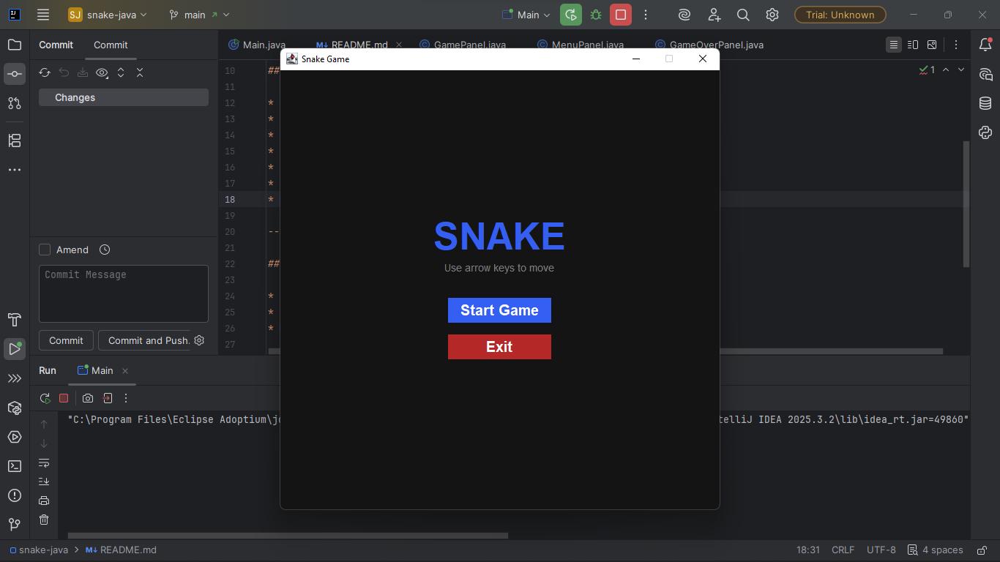
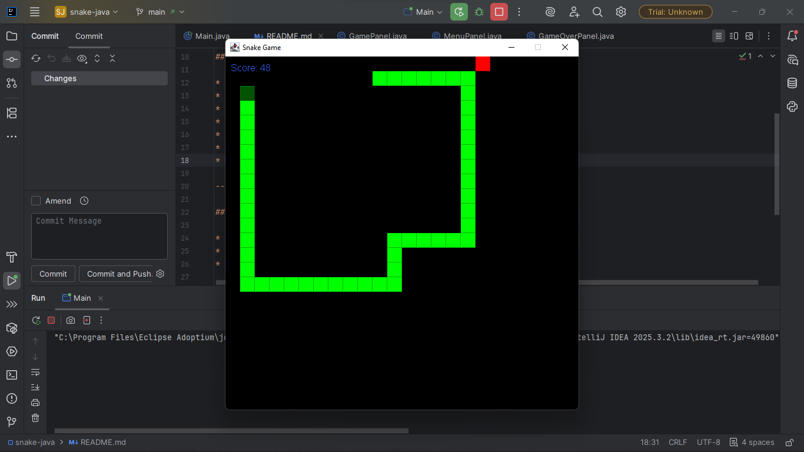
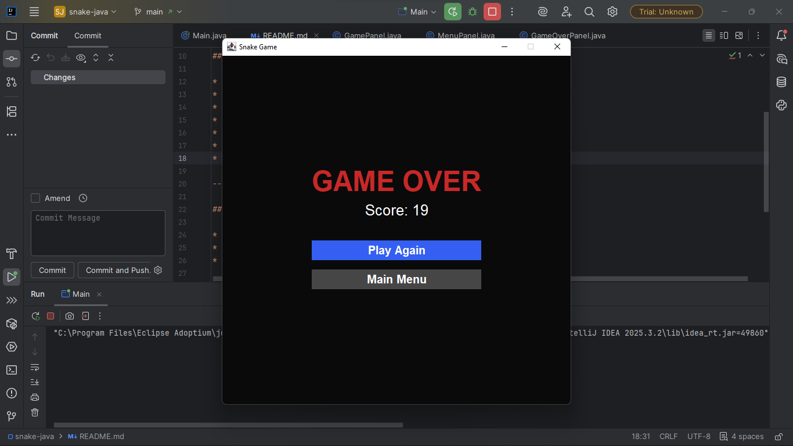

# Snake

A Java Swing implementation of the classic Snake game, I'll be adding personal touch later.


---

## Features

* Grid-based movement
* Food spawning at positions not inside the snake
* Score tracking
* Collision detection (walls & self)
* Game loop using `javax.swing.Timer`
* Multi-panel architecture (Menu → Game → Game Over)
* Clean panel navigation with CardLayout
* Game state resets correctly on retry and main menu return

---

## Project Structure
```
src/
  panels/
    GamePanel.java        # Snake gameplay, rendering, movement logic
    MenuPanel.java        # Title screen with start and exit
    GameOverPanel.java    # Score display with retry and menu options
  utils/
    Tile.java             # Grid position utility
    GameOverListener.java # Callback interface for game over events
  Main.java               # JFrame setup and panel switching
```

---

## To-Do

* Difficulty selection
* High score per difficulty
* Multiplayer mode

---

## Game Series

This game is part of a larger game series am working on. Check it out on GitHub:
👉🏽 [here](https://github.com/ZLouisMiguel/game-jam-series)

---

## Preview



